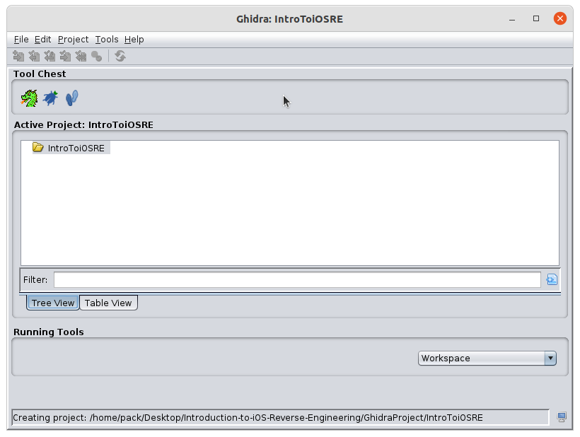
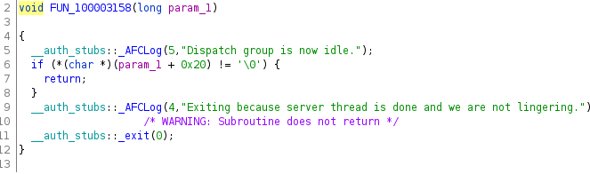

# iOS Reverse Engineering

## Table of Contents

* [Introduction](#introduction)
* [Prerequisites](#prerequisites)
  * [Optional Prerequisites](#optional-prerequisites)
  * [Recommended Resources](#recommended-resources)
* [Tools](#tools)
* [Basics of iOS](#basics-of-ios)
  * [Mach-O Files](#mach-o-files)
  * [Inter-Process Communication (IPC)](#ipc_mechanisms)
    * [Mach IPC](#mach-ipc)
      * [Mig](#mig)
    * [XPC](#xpc)
      * [xpcspy](#xpcspy)
  * [ARC](#arc)
  * [Dispatch Queues](#dispatch-queues)
  * [Dyld Shared Cache](#dyld-shared-cache)
    * [Extracting Frameworks](#extracting-frameworks)
  * [Entitlements/Codesign](#ents_codesign)
    * [Dumping Entitlements](#dumping-entitlements)
    * [Signing Entitlements](#signing-entitlements)
  * [Frameworks](#frameworks)
  * [Listing Library Dependencies](#listing-library-dependencies)
  * [Sourcing Files](#sourcing_files)
* [Preliminary Analysis of Mach-O Files](#anal_of_mach_o)
* [Static Analysis with Ghidra](#static-analysis-with-ghidra)
  * [Working with IPSWs](#working-with-ipsws)
    * [Extracting the Filesystem from the IPSW](#extracting-the-filesystem-from-the-ipsw)
    * [Mounting the iOS Filesystem](#mounting-the-ios-filesystem)
    * [Unmounting the iOS Filesystem](#unmounting-the-ios-filesystem)
  * [Finding System Daemons](#finding-system-daemons)
  * [Initial Probe](#initial-probe)
    * [Looking at Symbols](#looking-at-symbols)
    * [Looking at Strings](#looking-at-strings)
    * [Looking at Library Dependencies](#looking-at-library-dependencies)
    * [Looking at Entitlements](#looking-at-entitlements)
    * [Making Assumptions](#making-assumptions)
  * [Taking a Look in Ghidra](#taking-a-look-in-ghidra)
    * [Disassembler View](#disassembler-view)
    * [Decompiler View](#decompiler-view)
    * [Symbol Tree](#symbol-tree)
    * [Find the Starting Point](#find-the-starting-point)
      * [Renaming the `entry` Symbol](#renaming-the-entry-symbol)
    * [Looking at the XPC Service Creation](#looking-at-the-xpc-service-creation)
    * [Looking at Code Blocks](#looking-at-code-blocks)
      * [Code Block Arguments](#code-block-arguments)
  * [Conclusions](#conclusions)
* [Dynamic Instrumentation using Frida](#dynamic-instrumentation-using-frida)(WIP)
  * [Setting Up Frida](#setting-frida-up)
    * [Installing the CLI tools](#installing-the-cli-tools)
    * [Installing the Libraries](#installing-the-libraries)
    * [Setting up `iproxy`](#setting-up-iproxy)
  * [Trying out the Tools](#trying-out-the-tools)
    * [Starting `iproxy`](#starting-iproxy)
    * [Running `frida-ps`](#running-frida-ps)
  * [Being Lazy and Using `frida-trace`](#being-lazy-and-using-frida-trace)
* [Credits](#credits)

## Disclaimer

Before you start reading, just know the goal of this guide was to help streamline learning the process of reverse engineering on iOS. Unfortunately, re-uploading it escaped my mind so it's become quite out of date. I still believe the content is still useful from a "what do I need to do the thing" point of view so I've updated some sections to use more modern tooling. Unfortunately this resulted undermining an original goal I had which was to avoid depending on having a computer capable of running macOS.

It is worth noting that there's plenty of macOS virtualization options out there, most notably I know I was able to get [OSX-KVM](https://github.com/kholia/OSX-KVM) working to run macOS Sanoma 14.5 from Ubuntu which can be used to source the libraries from.

If I end up revisiting this idea and modernizing the process, you can follow me on Twitter [@ghidra_enjoyer](https://twitter.com/ghidra_enjoyer) where I'm sure I'll post something about it.

## Introduction

Before I begin, I would like to officially welcome you to iOS reverse engineering. In this guide, I'll be covering the following main topics:

* Basics of iOS;
* Preliminary Analysis of Mach-O Files;
* Static Analysis with Ghidra;
* Dynamic Instrumentation using Frida (~~WIP~~ Incomplete, this will not be completed).

Furthermore, the purpose of this guide is intended to be used by beginners to get into iOS reverse engineering and seeing how the various tools can be used. This is not an arm reversing guide or an exploitation course, but rather a resource to be used for figuring out things on your own. All I've done is compiled the basic tools to get you started.

## Prerequisites

The prerequisites for this guide are quite simple really, you'll need the following:

1. An Internet Connection.
2. A computer with macOS or Linux (I'll be using Ubuntu in this guide) installed.
3. Familiarity with the C programming language.

### Optional Prerequisites

* A jailbreakable iOS (or iPad) device, At the time of writing, the following tools are available:
  1. [checkra1n](https://checkra.in/) iPhone 5s to iPhone X on iOS 12.0 and up (recommended, tend to have support first on new version)
  2. [unc0ver](https://unc0ver.dev/) iPhone SE to iPhone 12(s) on iOS 11.0-14.3 (wide net range) (There's some support for 14.4-14.8 as well, but I recommend doing your own research on this tool before using it)
  3. [Taurine](https://taurine.app/) iPhone SE to iPhone 12(s) on iOS 11.0-14.3 (alternative to unc0ver)
  4. [palera1n](https://palera.in/) Successor to checkra1n, supports devices with A8 to A11 on iOS 15 and higher. This also supports iPadOS 17 on 6th/7th generation iPads. If you get an iPad for jailbreaking purposes, I recommend getting a 7th generation one.
  5. [Dopamine](https://ellekit.space/dopamine/) Jailbreak for arm64e devices running iOS 15.0 -16.5.1 (also supports up to iOS 16.6.1 for arm64, personally I find palera1n easier to install for those devices).
* Familiarity with the ObjC programming language.

Personally, I will be using an iPhone 12 Mini on iOS 14.5.1 throughout this guide jailbroken with unc0ver (Fugu14).

### Recommended Resources

* Jonathan Levin's (@Morpheus______) OS* Internals Book (http://newosxbook.com/index.php).

## Tools

At various points in this guide, I'll be using different tools in order to extract useful information during the reversing process. I recommend you get the following tools set up prior to starting the guide:

1. [jtool2](http://newosxbook.com/tools/jtool.html), otool alternative and info dumping for Mach-O files.
2. [DyldExtractor](https://github.com/arandomdev/DyldExtractor), tool used to extract Frameworks from the dyld_shared_cache
3. [apfs-fuse](https://github.com/sgan81/apfs-fuse), hdiutil alternative for Linux users.
4. [Ghidra](https://github.com/NationalSecurityAgency/ghidra), disassembler.
5. [Frida](https://frida.re/), this allows dynamic instrumentation and will require a jailbroken device for our purposes.

It is worth noting that [ipsw](https://github.com/blacktop/ipsw) provides the functionality of the first two tools.

## Basics of iOS

In this section, you'll find the basic information needed to get through the guide. I also cover certain topics that I've found useful over the course of my (short) career and as such, I encourage you to dig deeper into the topic when possible. Before I start covering this information, it's important to keep in mind most of this can be found with a Google search, man page lookup or even looking at Apple documentation.

### Mach-O Files

The first topic we'll cover is the file format of the executables/libraries on iOS (and macOS). If you want to know more on this topic, the [Wikipedia](https://en.wikipedia.org/wiki/Mach-O) page is a good place to start.

<a id="ipc_mechanisms"></a>

### Inter-Process Communication (IPC)

While I could spend hours covering the topic of IPCs, I believe that some mechanisms are more prevelant than others when it comes to iOS. I strongly recommend getting familiar with this part of the guide as this will be core knowledge for quite a while during your future reversing projects.

#### Mach IPC

Not to be confused with the [Mach microkernel](https://en.wikipedia.org/wiki/Mach_(kernel)), the first IPC mechanism to cover is Mach IPC, which is arguably the single most important IPC used in iOS. In any case, the reason this IPC is important is because a lot of IPC calls are done via `mach_sendmsg` calls to the Frameworks bundled into a file called the dyld cache.

A lot of information can be found on the Mach IPC, and I strongly recommend looking into these are they're extremely common to encounter its APIs when reverse engineering on iOS.

##### Mig

Mach Interface Generator (MIG) is effectively a Mach wrapper that abstracts out the port creation and message sending to allow linking against symbols rather than arbitrarily set numbers. You can find these calls using `jtool2` by using the following command in the CLI: `jtool2 -d __DATA.__const /path/to/executable | grep MIG`.

#### XPC

XPC is another common tool where I've recently started paying more attention to, but so far I've mainly noticed their use to be for sending serialized copies of an object (usually data sets like dictionaries) from one process to another. Just like Mig, it effectively wraps Mach calls. This is just a higher level IPC mechanism that's easier to interact with.

You can find more information on XPC calls [here](https://xphosnet.blogspot.com/2021/12/xpc-hello-world-in-c-on-ios.html?m=1).

##### xpcspy

xpcspy is a useful tool for intercepting XPC messages being passed to a process. I'll cover this in more details in part 2 as it builds onto Frida. You can find the tool [here](https://github.com/hot3eed/xpcspy).

### ARC

ARC stands for Automatic Reference Counting which is the mechanism used to keep track of memory allocations done for ObjC and Swift objects in the form of garbage collection. I've found that the source code related to this subject is interesting and a good way to get used to reading source code.

You can find more on the subject [here](https://docs.swift.org/swift-book/LanguageGuide/AutomaticReferenceCounting.html).

### Dispatch Queues

The documentation on dispatch queues can be found [here](https://developer.apple.com/documentation/dispatch/dispatchqueue), but in my understanding of them, they mainly serve as a way to encourage multitasking in applications.

### Dyld Shared Cache

In iOS 8.0, the SDK stopped including frameworks in favor of a massive cache called the [dyld shared cache](https://iphonedev.wiki/index.php/Dyld_shared_cache). This file is extremely important as it gives us a binary that can be analyzed in order to figure out how things work under the hood. While I don't recommend analyzing this file as a whole, it is possible and Ghidra can ingest it (this will take an extremely long time).

### Sourcing Libraries

All of the commands in this section have the option to add a `--output /path/to/output` flag to keep things organized.

#### Download the IPSW

The `ipsw` tool allows you to downlo an IPSW using the following command:
```ipsw download ipsw -d iPhone13,1 -v 14.5.1```

#### Extract the Dyld Shared Cache

Once downloaded, you'll want to extract the dyld shared cache:

```ipsw extract -d iPhone13,1_14.5.1_18E212_Restore.ipsw```

It is worth noting I couldn't get this step working on Linux due to `ipsw` complaining about `apfs-fuse` not being found in the path despite it being there. I'm not really looking to get a Linux setup going, but this goes to show how much easier iOS/macOS reversing is when you have a macOS computer. If you want to continue following along the guide, you'll either need a macOS computer or you'll need to find an alternative method for extracting the shared cache from the IPSW.

#### Extracting Libraries

You can extract a particular library as such:
`ipsw dsc macho 18E212__iPhone13,1/dyld_shared_cache_arm64e -e libAFC.dylib`

If you're on macOS, you should also be able to extract all libraries at once using:
`ipsw dsc split 18E212__iPhone13,1/dyld_shared_cache_arm64e`


<a id="ents_codesign"></a>

### Entitlements/Codesign

In order for an executable to be permitted to execute in iOS, it must be codesigned (and sandboxed). Furthermore, certain APIs require specific entitlements in order to be used and this is done through entitlements. Entitlements are effectively a list of strings with some associated value (string, int, array, dictionaries, etc.) stored in the XML format used to depict the various permissions needed to perform certain actions.

#### Dumping Entitlements

In order to dump entitlements you can use either options below:
1. `jtool2 --ent /path/to/executable` (you can pass the `-v` argument in order to get a more human readable output);
2. `ldid2 -e /path/to/executable`.
3. `ipsw macho info -e /path/to/executable`

#### Signing Entitlements

If you want to execute a binary on a jailbroken device, you can do so by using your own developer certificate (I'm 99.9% certain a free developer account works):
1. `jtool2 --sign --ent /path/to/entitlements/xml /path/to/executable`
2. `ldid2 -S/path/to/entitlements.xml /path/to/executable`

Both `jtool2` and `ldid2` are really reliable in my opinion and for those on OSX, you can use the `codesign` command. I don't really have much experience with it, but I have seen some people prefer it. I just don't find it as intuitive as `jtool2` or `ldid2`. `ipsw` also has this functionality.

### Frameworks

I've mentioned that frameworks are found in the [Dyld Shared Cache](#dyld-shared-cache), but I didn't go into much detail and that's because I wanted to cover them in their own sub-section. There exists both public frameworks and Private Frameworks which contain the APIs made by Apple. When a developer wants to publish an application to the App Store, it must go through review. Apple will refuse applications using the Private Frameworks as they only want developers using the public frameworks which they document (to a limted degree...). In any case, the reason why I put so much importance on frameworks is because you can sometimes tell what an executable might be doing based off what frameworks they're linking against.

### Listing Library Dependencies

In order to learn more about a Mach-O file, you can list the library dependencies which will include both the linked libraries and the frameworks it depends on. The best part of this process is being able to find the libraries on file (with some exceptions, notably frameworks as they're in the dyld share cache.). In order to get these library dependencies, you can either use `otool` (on macOS) or `jtool2` which are interchangeable in the following CLI command: 

`jtool2 -L /path/to/executable`

<a id="sourcing_files"></a>

### Sourcing Files

Finally, before we get started with ghidra, I'd like to cover a more practical topic for this guide which is sourcing files. We've previously covered how to get the [Dyld Shared Cache](#dyld-shared-cache) and this technique works for any file on the device. While some people might have more efficient methods, I've found that when I'm reverse engineering, it's more practicaly to source my files from an ipsw where I'm not restricted by needing a jailbreak. The process is straightforward as all I have to do is mount and traverse the largest .dmg of an ipsw.

I don't believe any more detail is necessary for this, as finding a file is just as you would for any other filesystem but I will be covering more about the ssh aspect of jailbroken devices when I get to writing part two of the guide covering [Frida](#instrumentation-using-frida).

<a id="anal_of_mach_o"></a>

## Preliminary Analysis of Mach-O Files

Now that the basics have been covered, let's get started with reversing our targets. While this step is optional, I personally do this step as it allows me to make an intuitive guess as to whether or not this file is worth looking into or not. Quite often, the first file you look into starts a rabit hole that brings you to a private framework or library which contains what you're truly looking for.

These are the first steps I take when it comes to analyzing a Mach-O file:

1. List out the library dependencies (See the [Listing Frameworks](#listing-frameworks) section above). This provides us basic information as to what libraries or frameworks are being used.
2. List out the symbols, this is straightforward, a simple `nm` (on macOS) or you can use `jtool2 -S /path/to/executable`. Various information can be extracted during this step:
    * The function names are stripped/obfuscated, this gets me prepared to know how "fun" the reversing will be.
    * What functions are in there, you can `grep` the output for patterns you're interested in. Usually non-obfuscated symbols are quite on the nose of what they do.
    * You can sometimes infer as to the purpose of the library based off the symbols extracted here.
3. List out the strings (`strings /path/to/file`), you might find something interesting;
4. List out any entitlements (See the [Dumping Entitlements](#dumping-entitlements) section above), some entitlements can tell you exactly what the file has access to. This can be useful from a forensics point of view.

## Static Analysis with Ghidra

Now that we've covered some basic information, it's about time we start a practical example and go over the reversing process using Ghidra. For this guide, I've picked to reverse a system daemon called `afcd`. The reason I picked this daemon is because it's not obfuscated and relatively small making it an optimal target for a beginner to start with. It also doesn't have any open source code (that I could find), so the only way to learn more about its internals will be to reverse engineer it. It is worth noting that due to it being unobfuscated, the reversing process will be extremely straightforward and unlikely to require looking at actual opcodes and we'll mostly be looking over the pseudo-C code Ghidra generates.

Before we begin, I'll be going into detail on how you can source your files for reverse engineering. When it comes to system files, we have two ways of doing so:

1. Extracting from an ipsw
2. Pulling from a physical device

### Working with IPSWs

As I've previously said, I want to make iOS reverse engineering more accessible, and as such, I'll opt towards sourcing my executables from an ipsw since it removes the need for a jailbroken iOS device. I usually obtain my ipsw download links from a website called https://ipsw.me/ (or https://ipsw.dev/ for beta ipsws) due to how easy it is to use.

_For the purpose of being able to follow along, I'll be doing this on Ubuntu 21.10 with an ipsw for an iPhone 12 Mini running iOS 14.5.1, you can download the ipsw from Apple using this [link](http://updates-http.cdn-apple.com/2021SpringFCS/fullrestores/071-34342/B5B1F08D-A82C-4785-A2F7-05D137853798/iPhone13,1_14.5.1_18E212_Restore.ipsw)._

#### Extracting the Filesystem from the IPSW

The next step is to extract the iOS filesystem from the ipsw, you can extract the contents just like any old zipfile using:

`unzip iPhone13,1_14.5.1_18E212_Restore.ipsw -d extracted_ipsw/`

#### Mounting the iOS Filesystem

Once we've unzipped the ipsw, we'll notice there's various files, you can find more information about them [here](https://www.theiphonewiki.com/wiki/IPSW_File_Format). We only care about the largest `.dmg` file in there as it contains the iOS filesystem. The next step, which is more difficult on Linux is mounting the `.dmg`.

For those using macOS, you'll be happy to hear this is really simple. You can either do this through the finder by double clicking it, or, you can use `hdiutil mount /path/to/largest.dmg`. 

Unfortunately, for those using Linux, this process is a bit more involved but once setup, it becomes extremely easy. You'll first want to have [apfs-fuse](https://github.com/sgan81/apfs-fuse) installed. Once installed, you'll want to mount the larged `.dmg` using:

`apfs-fuse -o allow_other extracted_ipsw/018-39736-002.dmg mount/`

The `-o allow_other` is passed in order to be able to read the files, without this, you'll need to be doing it as `root` which can get quite tedious.

At this point, we'll now have access to the filesystem at `mount/root/` which is what the `/` directory will refer to when we're working with the iOS filesystem.

#### Unmounting the iOS Filesystem

When it comes to unmounting the filesystem, the process is pretty straightforward. For macOS users, you can either eject it like you would any other mount (e.g, a USB) or, you can use `hdiutil unmount /dev/device-name`.

As for Linux users, you'll want to unmount it using `umount mount/` (where `mount/` is where you mounted the `.dmg` using `apfs-fuse`).

### Finding System Daemons

The best part of reversing system daemons in iOS, is that finding them is extremely easy. There's a bunch of `.plist` files found in the `/System/Library/LaunchDaemons/` directory which contain various information such as the path to the executable and in some instances, the arguments passed to it. In our case, we're looking for `afcd`, but, unfortunately I encountered an issue where I couldn't read this file. Luckily, I do know that `afcd` is located in `/usr/libexec/` (where a wide range of system daemons reside).

### Initial Probe

Now that we've got our executable, it's time that we probe the executable for some surface level information.

#### Looking at Symbols

First, let's begin by looking at the symbols (using `jtool2 -S afcd`):
```no-highlights
jtool2 -S afcd 
0000000100000000 S __mh_execute_header
                 U _AFCConnectionCreate
                 U _AFCConnectionGetContext
                 U _AFCConnectionInvalidate
                 U _AFCConnectionSetContext
                 U _AFCConnectionSetDisposeSecureContextOnInvalidate
                 U _AFCConnectionSetIOTimeout
                 U _AFCConnectionSetSecureContext
                 U _AFCCreateServerContext
                 U _AFCFreeServerContext
                 U _AFCInitServerConnection
                 U _AFCLog
                 U _AFCPlatformInitialize
                 U _AFCServeWithRoot
                 U _AFCServerConnectionSetFileCoordinationEnabled
                 U _AFCServerContextGetLockdownConnection
                 U _AFCServerContextGetRootPath
                 U _AFCServerContextSetLockdownConnection
                 U _AFCServerContextSetRootPath
                 U _CFDictionaryAddValue
                 U _CFDictionaryCreateMutable
                 U _CFDictionaryGetTypeID
                 U _CFDictionaryGetValue
                 U _CFGetTypeID
                 U _CFRelease
                 U _CFStringCompare
                 U _CFStringCreateWithCString
                 U _CFStringGetCString
                 U _CFStringGetTypeID
                 U _MKBUserTypeDeviceMode
                 U __NSConcreteStackBlock
                 U ___error
                 U ___stack_chk_fail
                 U ___stack_chk_guard
                 U ___stderrp
                 U ___strcat_chk
                 U ___strcpy_chk
                 U __xpc_error_connection_invalid
                 U __xpc_error_key_description
                 U __xpc_error_termination_imminent
                 U __xpc_type_connection
                 U __xpc_type_dictionary
                 U __xpc_type_error
                 U _bzero
                 U _container_system_group_path_for_identifier
                 U _dispatch_get_global_queue
                 U _dispatch_group_async_f
                 U _dispatch_group_create
                 U _dispatch_group_notify
                 U _dispatch_main
                 U _dispatch_queue_create
                 U _dispatch_set_target_queue
                 U _exit
                 U _free
                 U _fwrite
                 U _getopt_long
                 U _kCFAllocatorDefault
                 U _kCFTypeDictionaryKeyCallBacks
                 U _kCFTypeDictionaryValueCallBacks
                 U _kLockdownCheckinConnectionInfoKey
                 U _kLockdownCheckinPath
                 U _kMKBDeviceModeKey
                 U _kMKBDeviceModeMultiUser
                 U _kqueue
                 U _lockdown_copy_checkin_info
                 U _lockdown_disconnect
                 U _lockdown_get_securecontext
                 U _lockdown_get_socket
                 U _lstat
                 U _mkdir
                 U _realpath$DARWIN_EXTSN
                 U _sandbox_extension_consume
                 U _sandbox_extension_issue_file
                 U _sandbox_free_error
                 U _sandbox_init
                 U _secure_lockdown_checkin
                 U _setsockopt
                 U _signal
                 U _strcmp
                 U _strdup
                 U _strerror
                 U _xpc_connection_cancel
                 U _xpc_connection_create_mach_service
                 U _xpc_connection_resume
                 U _xpc_connection_set_event_handler
                 U _xpc_dictionary_get_string
                 U _xpc_get_type
                 U _xpc_transaction_begin
                 U _xpc_transaction_end
```

At a first glance, we notice these are all unlinked and will be loaded during the runtime. However, we can already see some interesting symbols:

* `_sandbox_init` which makes me believe it will want to create a sandbox.
* `_xpc_connection_create_mach_service` which makes me believe it handles XPC requests.
* `_dispatch_queue_create` Performs some sort asynchronous looping activity. My guess is this mostly for the XPC services.
* `_AFCLog` points towards the use of some logging. This will help us get some context as to what is happening.

#### Looking at Strings

Since we know there's a logging function (I have yet to encounter any `*Log` symbol that wasn't a logging function), we should probably look at the strings using by `strings afcd`:

``` no-highlights
strings afcd 
__PAGEZERO
__TEXT
__text
__TEXT
__auth_stubs
__TEXT
__const
__TEXT
__cstring
__TEXT
__info_plist
__TEXT
__unwind_info
__TEXT
__DATA_CONST
__auth_got
__DATA_CONST
__got
__DATA_CONST
__const
__DATA_CONST
__DATA
__data
__DATA
__bss
__DATA
__RESTRICT
__restrict
__RESTRICT
__LINKEDIT
/usr/lib/dyld
/System/Library/PrivateFrameworks/MobileKeyBag.framework/MobileKeyBag
/usr/lib/liblockdown.dylib
/usr/lib/libafc.dylib
/System/Library/Frameworks/CoreFoundation.framework/CoreFoundation
/System/Library/Frameworks/IOKit.framework/Versions/A/IOKit
/usr/lib/libSystem.B.dylib
)@q!
@(#)PROGRAM:afcd  PROJECT:afc-273
/private/var/mobile/Media
afcd starting
crash-reporter
com.apple.crashreportcopymobile
com.apple.afcd
systemgroup.com.apple.osanalytics
Failed to retrieve group container systemgroup.com.apple.osanalytics
/Library/Logs/DiagnosticReports
/private/var/mobile/Library/Logs/CrashReporter
kqueue(): %m
could not stat directory %s: %d
Path %s is a symlink.
could not create directory %s (%d)
realpath(%s) failure: %s
Serving directory %s
directory %s mode is 0x%x
path %s is not a directory
failed to load sandbox
afcd xpc listener
v8@?0
Ready to start
usage: afcd [-r]
  -r | --crash-reporter      : run afcd for crash reporter
com.apple.afc.root
sandbox_extension_issue_file failed: %d
afcd
Could not load afcd sandbox profile: %s
sandbox_extension_consume failed (%d): %s
Creating XPC service %s
Could not create XPC listener.
XPC connection closing, time to go
Got XPC error on listener connection: %s
Unknown XPC event
v16@?0^v8
Handle XPC connection
event handler
Processing checkin
Checkin handled
Should not get XPC message after checkin.
XPC connection should close now
The connection is now invalid.
Got XPC error on xpc connection: %s
Unexpected XPC event; this connection is toast.
Resuming connection
handle connection done
Handle lockdown message
Checked in with lockdown on path '%s' socket %d with%s SSL
Could not check in with lockdown at '%s': %d
Lockdown message handled
run_connection for root %s
Could not set SO_NOSIGPIPE: %s
no memory: %m
could not open connection: %m
Using async dispatch queue
Dispatch group is now idle.
Exiting because server thread is done and we are not lingering.
Running server thread
Server thread finished
<?xml version="1.0" encoding="UTF-8"?>
<!DOCTYPE plist PUBLIC "-//Apple//DTD PLIST 1.0//EN" "http://www.apple.com/DTDs/PropertyList-1.0.dtd">
<plist version="1.0">
<dict>
	<key>CFBundleDevelopmentRegion</key>
	<string>English</string>
	<key>CFBundleExecutable</key>
	<string>afcd</string>
	<key>CFBundleIdentifier</key>
	<string>com.apple.afcd</string>
	<key>CFBundleInfoDictionaryVersion</key>
	<string>6.0</string>
	<key>CFBundleDisplayName</key>
	<string>afcd</string>
	<key>CFBundleSignature</key>
	<string>????</string>
	<key>CFBundleVersion</key>
	<string>1.0</string>
	<key>CFBundleName</key>
	<string>afcd</string>
	<key>CFBundleShortVersionString</key>
	<string>2.0</string>
</dict>
</plist>
_AFCConnectionCreate
_AFCConnectionGetContext
_AFCConnectionInvalidate
_AFCConnectionSetContext
_AFCConnectionSetDisposeSecureContextOnInvalidate
_AFCConnectionSetIOTimeout
_AFCConnectionSetSecureContext
_AFCCreateServerContext
_AFCFreeServerContext
_AFCInitServerConnection
_AFCLog
_AFCPlatformInitialize
_AFCServeWithRoot
_AFCServerConnectionSetFileCoordinationEnabled
_AFCServerContextGetLockdownConnection
_AFCServerContextGetRootPath
_AFCServerContextSetLockdownConnection
_AFCServerContextSetRootPath
_CFDictionaryAddValue
_CFDictionaryCreateMutable
_CFDictionaryGetTypeID
_CFDictionaryGetValue
_CFGetTypeID
_CFRelease
_CFStringCompare
_CFStringCreateWithCString
_CFStringGetCString
_CFStringGetTypeID
_MKBUserTypeDeviceMode
___error
___stack_chk_fail
___strcat_chk
___strcpy_chk
_bzero
_container_system_group_path_for_identifier
_dispatch_get_global_queue
_dispatch_group_async_f
_dispatch_group_create
_dispatch_group_notify
_dispatch_main
_dispatch_queue_create
_dispatch_set_target_queue
_exit
_free
_fwrite
_getopt_long
_kqueue
_lockdown_copy_checkin_info
_lockdown_disconnect
_lockdown_get_securecontext
_lockdown_get_socket
_lstat
_mkdir
_realpath$DARWIN_EXTSN
_sandbox_extension_consume
_sandbox_extension_issue_file
_sandbox_free_error
_sandbox_init
_secure_lockdown_checkin
_setsockopt
_signal
_strcmp
_strdup
_strerror
_xpc_connection_cancel
_xpc_connection_create_mach_service
_xpc_connection_resume
_xpc_connection_set_event_handler
_xpc_dictionary_get_string
_xpc_get_type
_xpc_transaction_begin
_xpc_transaction_end
__NSConcreteStackBlock
___stack_chk_guard
___stderrp
__xpc_error_connection_invalid
__xpc_error_key_description
__xpc_error_termination_imminent
__xpc_type_connection
__xpc_type_dictionary
__xpc_type_error
_kCFAllocatorDefault
_kCFTypeDictionaryKeyCallBacks
_kCFTypeDictionaryValueCallBacks
_kLockdownCheckinConnectionInfoKey
_kLockdownCheckinPath
_kMKBDeviceModeKey
_kMKBDeviceModeMultiUser
__mh_execute_header
__mh_execute_header
_AFCConnectionCreate
_AFCConnectionGetContext
_AFCConnectionInvalidate
_AFCConnectionSetContext
_AFCConnectionSetDisposeSecureContextOnInvalidate
_AFCConnectionSetIOTimeout
_AFCConnectionSetSecureContext
_AFCCreateServerContext
_AFCFreeServerContext
_AFCInitServerConnection
_AFCLog
_AFCPlatformInitialize
_AFCServeWithRoot
_AFCServerConnectionSetFileCoordinationEnabled
_AFCServerContextGetLockdownConnection
_AFCServerContextGetRootPath
_AFCServerContextSetLockdownConnection
_AFCServerContextSetRootPath
_CFDictionaryAddValue
_CFDictionaryCreateMutable
_CFDictionaryGetTypeID
_CFDictionaryGetValue
_CFGetTypeID
_CFRelease
_CFStringCompare
_CFStringCreateWithCString
_CFStringGetCString
_CFStringGetTypeID
_MKBUserTypeDeviceMode
__NSConcreteStackBlock
___error
___stack_chk_fail
___stack_chk_guard
___stderrp
___strcat_chk
___strcpy_chk
__xpc_error_connection_invalid
__xpc_error_key_description
__xpc_error_termination_imminent
__xpc_type_connection
__xpc_type_dictionary
__xpc_type_error
_bzero
_container_system_group_path_for_identifier
_dispatch_get_global_queue
_dispatch_group_async_f
_dispatch_group_create
_dispatch_group_notify
_dispatch_main
_dispatch_queue_create
_dispatch_set_target_queue
_exit
_free
_fwrite
_getopt_long
_kCFAllocatorDefault
_kCFTypeDictionaryKeyCallBacks
_kCFTypeDictionaryValueCallBacks
_kLockdownCheckinConnectionInfoKey
_kLockdownCheckinPath
_kMKBDeviceModeKey
_kMKBDeviceModeMultiUser
_kqueue
_lockdown_copy_checkin_info
_lockdown_disconnect
_lockdown_get_securecontext
_lockdown_get_socket
_lstat
_mkdir
_realpath$DARWIN_EXTSN
_sandbox_extension_consume
_sandbox_extension_issue_file
_sandbox_free_error
_sandbox_init
_secure_lockdown_checkin
_setsockopt
_signal
_strcmp
_strdup
_strerror
_xpc_connection_cancel
_xpc_connection_create_mach_service
_xpc_connection_resume
_xpc_connection_set_event_handler
_xpc_dictionary_get_string
_xpc_get_type
_xpc_transaction_begin
_xpc_transaction_end
radr://5614542
com.apple.afcd
5*U 8
TQ_7{
e%?'b
<?xml version="1.0" encoding="UTF-8"?>
<!DOCTYPE plist PUBLIC "-//Apple//DTD PLIST 1.0//EN" "http://www.apple.com/DTDs/PropertyList-1.0.dtd">
<plist version="1.0">
<dict>
	<key>com.apple.private.security.storage.Calendar</key>
	<true/>
	<key>com.apple.security.network.client</key>
	<true/>
	<key>com.apple.security.network.server</key>
	<true/>
	<key>com.apple.security.system-groups</key>
	<array>
		<string>systemgroup.com.apple.osanalytics</string>
	</array>
</dict>
</plist>
!com.apple.security.network.client
!com.apple.security.network.server
+com.apple.private.security.storage.Calendar
 com.apple.security.system-groups0#
!systemgroup.com.apple.osanalytics
```

#### Looking at Library Dependencies

At a first glance, we find the libraries at the start, but to be safe, let's extract them seperately using `jtool2 -O afcd`:

```no-highlights
/System/Library/PrivateFrameworks/MobileKeyBag.framework/MobileKeyBag (compatibility version 1.0.0, current version 1.0.0)
/usr/lib/liblockdown.dylib (compatibility version 1.0.0, current version 1.0.0)
/usr/lib/libafc.dylib (compatibility version 1.0.0, current version 1.0.0)
/System/Library/Frameworks/CoreFoundation.framework/CoreFoundation (compatibility version 150.0.0, current version 1775.115.0)
/System/Library/Frameworks/IOKit.framework/Versions/A/IOKit (compatibility version 1.0.0, current version 275.0.0)
/usr/lib/libSystem.B.dylib (compatibility version 1.0.0, current version 1292.100.5)
```

We can immediately ignore some libraries, such as `/usr/lib/libSystem.B.dylib`. The symbols in here are just wrappers to the kernelcache and we probably won't need to look under the hood here. We can also ignore `/System/Library/Frameworks/CoreFoundation.framework/CoreFoundation` since it mainly contains the base data structures. 
What I find interesting is the `/System/Library/PrivateFrameworks/MobileKeyBag.framework/MobileKeyBag` simply because it's a PrivateFramework. If I find a stub later on to some ObjC or Swift function, then I'd look at the symbols in here first. I also find the `IOKit` framework interesting, but for this guide, it's most likely not going to be important. 
As for the libs, they're most likely what contain the symbols this executable is linking against, so we might have to look into these in the future.

#### Looking at Entitlements

While we can also see the entitlements at the end of the strings dump, it's best to play it safe and extract them using `jtool2 --ent afcd`:
``` no-highlights
<?xml version="1.0" encoding="UTF-8"?>
<!DOCTYPE plist PUBLIC "-//Apple//DTD PLIST 1.0//EN" "http://www.apple.com/DTDs/PropertyList-1.0.dtd">
<plist version="1.0">
<dict>
	<key>com.apple.private.security.storage.Calendar</key>
	<true/>
	<key>com.apple.security.network.client</key>
	<true/>
	<key>com.apple.security.network.server</key>
	<true/>
	<key>com.apple.security.system-groups</key>
	<array>
		<string>systemgroup.com.apple.osanalytics</string>
	</array>
</dict>
</plist>
```

I don't really find much interesting yet, so let's continue.

#### Making Assumptions

After taking extracting all this information, I feel ready to make my first assumptions and set some goals.

The first thing I'd like to dive into are the following strings:

```no-highlights
crash-reporter
com.apple.crashreportcopymobile
com.apple.afcd
systemgroup.com.apple.osanalytics
Failed to retrieve group container systemgroup.com.apple.osanalytics
/Library/Logs/DiagnosticReports
/private/var/mobile/Library/Logs/CrashReporter
```

Using these strings, I'm able to understand there's some sort of group container which requires the following entitlement to access: 

```no-highlights
<key>com.apple.security.system-groups</key>
<array>
  <string>systemgroup.com.apple.osanalytics</string>
</array>
```

I wouldn't be surprised if the strings will be related to the `_sandbox_` symbols we've previously found.  The next piece of information are the following entitlements:

```no-highlights
<key>com.apple.security.network.client</key>
<true/>
<key>com.apple.security.network.server</key>
<true/>
```

These entitlements make me believe there's a server/client functionality in this daemon. This is further reinforced by the XPC related symbols as well as the `_AFCConnectionCreate` and `_AFCServeWithRoot` symbols which hint at this sort of functionality. As such, we'll probably be looking at how the  `_AFC*` symbols are used and possibly look deeper and try to figure out what they do by looking at `/usr/lib/libafc.dylib` (lib**AFC**.dylib is a bit on the nose haha). 

In any case, I feel this is a system daemon worth putting more time into.

### Taking a Look in Ghidra

At this point, we're ready to jump into Ghidra and let's begin by creating a project (File->New Project):


The first step is to select the project type, I usually select Non-Shared Projects.


The next step will be to name the project and select a parent directory:


If you've done everything correctly, you should be see the following page:



We can now import our file (File->Import File...) and select the `afcd` executable we pulled from the ipsw:


After pressing Ok, the following summary window should appear:


You'll notice that the libraries we listed earlier were not found and that's ok. When reversing iOS, you need to keep in mind everything is actually imported on runtime so any external dependency will inherently be a stub. In any case, we're free to continue on to actually opening the binary and have it analyzed. To do so, simply double click the file you want to analyze.


Once double clicked, it will ask you for the analysis options, I usually just go with the defaults and press analyze:


I recommend you give Ghidra time to analyze. Normally, I would just start analyzing it while I do my initial probe so I have something to do in the meantime. Luckily, for this example it should be relatively quick and you should have a similar view as the following:


As you might have noticed by now, there's a lot of windows in here. Luckily for those with multiple monitors, you can easily drag these out and they'll become their own standalone window. Let's begin breaking down each window and explaining them.

#### Disassembler View


This view contains the dissasembled code. This is where you'll actually see the assembly of the program.

#### Decompiler View

In addition to the disassembly view, there's also another window called the Decompiler view.


This window synchronizes with the disassembly window and will highlight a line of code if they match with a line of disassembled code that you have selected, the true is the same for the inverse.

#### Symbol Tree

The last notable window in this view that I'll cover is the Symbol Tree. This lists out the symbols in a tree format which makes navigating through symbols easier.


Usually, you'll want to find the `entry` symbol in this window and click it to start looking there (this is different for libraries since they don't require a `main` function to compile).

### Find the Starting Point

Since we know this is a system daemon, and the strings we saw in the previous dump had the following:

``` no-highlights
usage: afcd [-r]
  -r | --crash-reporter      : run afcd for crash reporter
```

It's best to look for the `main` function. The odd thing you might've noticed by now is that there is no `main` function, instead, it's going to be named `entry`. A common practice when reversing with Ghidra is to find this symbol and rename it to `main` since this is the nomenclature you should be used to if you're familiar with the C programming language. Let's start by finding the `entry` symbol in our Symbol Tree and selecting it:


#### Renaming the `entry` Symbol

You'll notice that your Disassembler view and the Decompiler view both jumped to it. Now, in the Decompiler view, we'll want to rename

```C
undefined8 entry(undefined8 param_1, undefined8 param_2)
```

to

```C
// We don't rename it to `char* const argv[]` because ghidra can't process it, so we'll just treat it as we would treat a double pointer. 
undefined8 entry(int argc, char** argv)
```

To do this, we just right-click on the function and select "Edit Function Signature". This will make the following window pop up and you can directly edit it in the text box:


At this point, you might be wondering how did I know this was the main function. Well, first, it's just how C programs work, and second, the `getopt_long` symbol really makes this obvious, in fact, we can go straight to a Decompiler snippet to know this (keep in mind, changing the arg names for the function changes them everywhere in the main function):


We notice that this is an infinite loop, so, we should probably look into the conditions that get us out of it.

Let's reverse this portion of the code:

```C
// Infinite loop, we'll go step by step here.
while( true ) {
  // I'm going to assume that this is the getopt_long call from the getopt(3) man page based off the arguments. As such, we know it's looking for a -r argument.
  iVar1 = getopt_long(argc, argv, "r", &PTR_DAT_100008000, 0);
  // The next step is checking if getopt_long returned -1 and if so, breaks out of the loop.
  if (iVar1 == -1) break;
  // On the off chance that it does not return 0x72 (we'll figure out why this value would be returned), then we get our first jump:
  if (iVar1 != 0x72) {
    FUN_100002990();
    goto LAB_1000028e8;
  }
  // Here, it overwrites the argument stored by the getopt_long call, this is interesting behavior that we'll look into if we notice a dead end in the previous functions, for now we'll ignore it.
  DAT_100008000 = "com.apple.crashreportcopymobile";.
} // while(true)
```

The first thing we want to check is what's the default value of `PTR_DAT_100008000`, so we can double-click on the label in our Decompiler view and it should bring us to it in memory:


According to the `man` page for `getopt(3)`, we should be expecting a pointer to the following struct to be passed:

```C
struct option
{
  const char *name;
  int         has_arg;
  int        *flag;
  int         val;
};
```

Assuming that `PTR_DAT_100008000->flag` is `NULL`, we should be expecting `PTR_DAT_100008000.val` to be our return value. As such, I'm quite interested in the `0x72` value, which is also the ascii value for 'r', which means, the if statement is only triggered if anything but "-r" is passed. Let's see what `FUN_100002990()` does when it's called:


Huh, that's not surprising, it just prints out the usage page and exits. Then what's the point of the `goto LAB_1000028e8`? Let's reconstruct the code calls:

```C
// Second goto
LAB_1000028f0:
  __auth_stubs::_AFCLog(1,pcVar8);
                  /* WARNING: Subroutine does not return */
  // Probably just exit(1).
  __auth_stubs::_exit(1);

// First goto
LAB_1000028e8:
  pcVar8 = "kqueue(): %m";
  goto LAB_1000028f0;
```

The interesting part of this bit is that I don't think pcVar8 has been set due to our first `goto`. As such, it makes me think this just a useless `goto` statement.

In any case, we can clearly make some sort of conclusion that there exists some sort of CrashReporter functionality but we're not really interested in that. Let's instead stay focused and try to figure out what happens if no arguments are passed. The next part of the code follows:


Well, since the code to set `DAT_100008000` was never triggered, it will remain as `NULL` (a.k.a, `0x0`). As such, it then gets set to "com.apple.afcd" followed by a `strcmp` for "com.apple.crashreportcopymobile" which obviously returns `-1`. This causes the code to skip over a noticable chunk of code. As such, let's move down in the view to include more code:


Well, we finally get to see `pcVar8` get set. Recall how logging it was part of the exit `goto` sequence when an invalid argument was passed. We're still not sure what this does, so we should keep going. From now on, since the reversing process is more straightforward, you'll start getting the decompiler snippets followed with a transcript containing my observations. It's strongly recommend you try figuring out what's going on on your own before looking at my observations.

```C
  // First step is to set pcVar8.
  pcVar8 = "/private/var/mobile/Media";
LAB_1000026b8:
  /*
  A call to the kqueue() stub is made. This is a kernel function that will return a queue to listen for kernel events. This is probably something we'll come back to at some point.
  */
  iVar1 = __auth_stubs::_kqueue();
  // If the syscall fails.
  if (iVar1 == -1) {
LAB_1000028e8:
    // Logs the kqueue return value (this value is passed through the stack. This is where the disassembly is useful.
    pcVar8 = "kqueue(): %m";
    // We know that this will just exit the process.
    goto LAB_1000028f0;
  }
  // This step performs an lstat on "/private/var/mobile/Media".
  iVar1 = __auth_stubs::_lstat(pcVar8,(stat *)&local_4f0);
  // Ensures the lstat call was successful.
  if (iVar1 < 0) {
    // Some error stub, not really interested in this.
    piVar5 = __auth_stubs::___error();
    if (*piVar5 == 2) goto LAB_100002704;
  }
  else {
    // Luckily for us, the logging tells us what's happening. In this instance, it's using the result of the lstat to determine if the path is a symlink.
    if ((local_4f0._4_2_ & 0xf000) == 0xa000) {
      pcVar8 = "Path %s is a symlink.";
      // This just jumps to a portion of the code that logs pcVar8 and exits.
      goto LAB_1000028a0;
    }
LAB_100002704:
    // According to https://opensource.apple.com/source/Libc/Libc-825.40.1/include/stdlib.h.auto.html, this seems to just be an alias to realpath whose man page simply resolves the path. Since the second argument is 0, it's most likely acting as some sort of sanitation function to avoid leaking files via relative paths (e.g, ../../../ur_password_db).
    DAT_100008048 = (char *)__auth_stubs::_realpath$DARWIN_EXTSN(pcVar8,0);
    // Performs a NULL-check on the path.
    if (DAT_100008048 == (char *)0x0) {
      // If it is NULL, calls some error stub, this probably checks to see if it is a recoverable error.
      piVar5 = __auth_stubs::___error();
      // 2 probably means it's a recoverable error since if it does not return 2, it leads to: print error -> exit goto.
      if (*piVar5 != 2) {
        piVar5 = __auth_stubs::___error();
        __auth_stubs::_strerror(*piVar5);
        pcVar8 = "realpath(%s) failure: %s";
        goto LAB_1000028f0;
      }
      // The recovery probably attempts to create the missing directory.
      iVar1 = __auth_stubs::_mkdir(pcVar8,0x1ed);
      // If a negative value is returned by mkdir.
      if (iVar1 < 0) {
        __auth_stubs::___error();
        // This further enforces the notion of this being a last ditch effort to fix the filesystem. As such, it logs and error and exits.
        pcVar8 = "could not create directory %s (%d)";
        goto LAB_1000028a0;
      }
      // If it manages to create the directory, it copies the string over to use it.
      DAT_100008048 = __auth_stubs::_strdup(pcVar8);
    }
```

Now that we know what each line does, we should try and collect our thoughts and see what we know. It seems like path validation is important, and for some reason, it really cares about the "/private/var/mobile/Media" __directory__ existing. Assuming this directory is set up properly, we can continue:


``` C
  // Continue where the previous screenshot ended.
  __auth_stubs::_AFCLog(4,"Serving directory %s");
  // Re-performs the lstat on the realpath or strdup return value.
  iVar1 = __auth_stubs::_lstat(DAT_100008048,(stat *)&local_4f0);
  // Ensures a non-negative value is returned. 
  if (-1 < iVar1) {
    // Logs the mode.
    __auth_stubs::_AFCLog(5,"directory %s mode is 0x%x");
    // Once again, luckily the logging makes knowing what's going on here extremely simple. It's just ensuring it's a directory.
    if ((local_4f0._4_2_ & 0xf000) != 0x4000) {
      // If it's not a directory, it prepares an error and goes to the end.
      pcVar8 = "path %s is not a directory";
      goto LAB_1000028a0;
    }
    // Sets this local variable to NULL.
    local_460 = (char *)0x0;
    /* POINT OF INTEREST!!! */
    // We're touching sandbox_* calls, which is one of the things I found interesting in the symbol dump. For now, let's skip over it and continue to see what happens.
    pvVar6 = (void *)__auth_stubs::_sandbox_extension_issue_file
                                ("com.apple.afc.root",DAT_100008048,0);
    // Here, it checks to see if the function returned a NULL pointer.
    if (pvVar6 == (void *)0x0) {
      // Which obviously results in a failure.
      __auth_stubs::___error();
      __auth_stubs::_AFCLog(1,"sandbox_extension_issue_file failed: %d");
    }
    else {
      // Once again, these are symbols of interest. So we'll skip over it for now, and keep observing.
      iVar1 = __auth_stubs::_sandbox_init("afcd",2,&local_460);
      if (iVar1 < 0) {
        __auth_stubs::_AFCLog(1,"Could not load afcd sandbox profile: %s");
        // This seems to do a cleanup, so it looks like the `_sandbox_extension_issue_file` is some sort of allocator.
        __auth_stubs::_sandbox_free_error(local_460);
      }
      else {
        // Once again, this is a function we'll put aside for now.
        lVar7 = __auth_stubs::_sandbox_extension_consume(pvVar6);
        // Seems like the `_sandbox_extension_issue_file` is actually some sort of token request. At this point it seems to be consuming the token returned by it. This is definetely interesting. In any case, it checks to see if it's successful.
        if (-1 < lVar7) {
          // It seems like after being consumed, the callee is responsible for free-ing the token.
          __auth_stubs::_free(pvVar6);
          // Creates a dispatch group.
          DAT_100008050 = __auth_stubs::_dispatch_group_create();
          // Proceeds to create a dispatch queue, I'm assuming in order to listen for XPC requests based off the label.
          object = __auth_stubs::_dispatch_queue_create
                              ("afcd xpc listener",(dispatch_queue_attr_t)0x0);
          // Creates a local reference to the dispatch queue.
          DAT_100008058 = object;
          // Gets the global queue.
          queue = __auth_stubs::_dispatch_get_global_queue(2,0);
          // Sets the dispatch queue to target the global queue.
          __auth_stubs::_dispatch_set_target_queue(object,queue);
          __auth_stubs::_AFCLog(4,"Ready to start");
          // I'm assuming this is some sort of start signal for the server to start serving, we'll investigate this function before we move onto the sandbox calls.
          FUN_1000029e0(DAT_100008040,DAT_100008058);
          // Loop on the main dispatch queue.
          __auth_stubs::_dispatch_main();
          // When the loop ends, it goes to a function that just prints "Failed to retrieve group container systemgroup.com.apple.osanalytics" before exiting. I guess it assumes that if it fails during the main loop, it's because of some sort of issue with the group?
          goto LAB_100002984;
        }
        __auth_stubs::___error();
        if (local_460 == (char *)0x0) {
          piVar5 = __auth_stubs::___error();
          __auth_stubs::_strerror(*piVar5);
        }
        __auth_stubs::_AFCLog(1,"sandbox_extension_consume failed (%d): %s");
      }
      // if _sandbox_extension_consume fails, then this ensures the token gets freed.
      __auth_stubs::_free(pvVar6);
    }
    // Prepares an error message.
    pcVar8 = "failed to load sandbox";
    // This will print the error message and exit.
    goto LAB_1000028a0;
  }
}
```

So far, we've confirmed that the "/private/var/mobile/Media" directory to be set up. We've also discovered that it's preparing for some sort of "asynchronous" functionality via dispatch queues. The interesting part now would be to either look into the sandbox calls to get familiar with the execution context as this might affect it. However, we also have a singular point of continuation on the regular execution path being `FUN_1000029e0("com.apple.afcd", XPC_LISTENER_DISPATCH_QUEUE)`. Since right after this call it goes on to loop indefinitely in the main dispatch queue, it's probably worth looking into first:


Just as before, I'll be going line by line until we reach a specific portion I feel should be covered on it's own.

```C
// Contextually, this is just a check to see if the XPC service is already initialized. 
if ( DAT_100008060 == 0 ) {
  // Creates the XPC connection object.
  __auth_stub::_AFCLog(4, "Creating XPC service %s");
  DAT_100008060 = __auth_stubs::_xpc_connection_create_mach_service(param_1, param_2, 1);
}
```

#### Looking at the XPC Service Creation

Let's take a break to dive deeper into the `__auth_stubs::_xpc_connection_create_mach_service(param_1, param_2, 1);` call. We can make a conclusion right away as to what's being created here. We know from our previous reversing that `param_1` was "com.apple.afcd" and `param_2` is the dispatch queue created under the label of "afcd xpc listener". The final piece of the puzzle is the third argument. Luckily for us, this is extremely simple because we can find that according to the [Apple documentation](https://developer.apple.com/documentation/xpc/1448783-xpc_connection_create_mach_servi), this last argument is a flag (we also know that the rest of the arguments line up with our known knowledge). Unfortunately, we'll have to dig a bit deeper to know what the `1` passed represents, but we're lucky enough that if we Google `XPC_CONNECTION_MACH_SERVICE_LISTENER`, we find some opensource code which defines it as follows:

```C
/*!
 * @constant XPC_CONNECTION_MACH_SERVICE_LISTENER
 * Passed to xpc_connection_create_mach_service(). This flag indicates that the
 * caller is the listener for the named service. This flag may only be passed
 * for services which are advertised in the process' launchd.plist(5). You may
 * not use this flag to dynamically add services to the Mach bootstrap
 * namespace.
 */
#define XPC_CONNECTION_MACH_SERVICE_LISTENER (1 << 0)
```

As such, we know that it's initializing a listener Mach service. We could have easily figure this out through the context, but going through these extra steps we can turn our assumption into a conclusion. In any case, let's continue:

```C
  // First, it checks to see if the creation of the listener was successful.
  if (DAT_100008060 == 0) {
    // If it failed, logs and error and exits.
    __auth_stubs::_AFCLog(1,"Could not create XPC listener.");
                  /* WARNING: Subroutine does not return */
    __auth_stubs::_exit(1);
  }
  // Next, we have this interesting structure being created. Let's dive deeper into this.
  local_58 = __got::__NSConcreteStackBlock;
  local_50 = 0x40000000;
  local_48 = FUN_100002abc;
  puStack64 = &DAT_1000042c0;
  local_38 = 0;
```

#### Looking at Code Blocks

In this part of the code, it's creating a code block. The reason I know this is that it's a common pattern and according to the [block implementation specifications](https://clang.llvm.org/docs/Block-ABI-Apple.html), a code block is defined as the following structure:

```C
struct Block_literal_1 {
    void *isa; // initialized to &_NSConcreteStackBlock or &_NSConcreteGlobalBlock
    int flags;
    int reserved;
    R (*invoke)(struct Block_literal_1 *, P...);
    struct Block_descriptor_1 {
        unsigned long int reserved;     // NULL
        unsigned long int size;         // sizeof(struct Block_literal_1)
        // optional helper functions
        void (*copy_helper)(void *dst, void *src);     // IFF (1<<25)
        void (*dispose_helper)(void *src);             // IFF (1<<25)
        // required ABI.2010.3.16
        const char *signature;                         // IFF (1<<30)
    } *descriptor;
    // imported variables
};
```

We can directly map this information using the code we're looking at:

```C
struct Block_literal_1
{
  void *isa;    // _NSConcreteStackBlock
  int flags;    // 0x40000000
  int reserved; // 0x0
  // This is just a function pointer.
  R (*invoke)(struct Block_literal_1 *, P..);   // FUN_100002abc
  struct Block_descriptor_1 {...} *descriptor;  // &DAT_1000042c0
}
```

While we could now determine and rename the types of our variables, it's not really worth our time. Instead, let's look into what the flag value represents. If we scroll down in the specifications, we find the following enum:

```C
enum {
    // Set to true on blocks that have captures (and thus are not true
    // global blocks) but are known not to escape for various other
    // reasons. For backward compatibility with old runtimes, whenever
    // BLOCK_IS_NOESCAPE is set, BLOCK_IS_GLOBAL is set too. Copying a
    // non-escaping block returns the original block and releasing such a
    // block is a no-op, which is exactly how global blocks are handled.
    BLOCK_IS_NOESCAPE      =  (1 << 23),

    BLOCK_HAS_COPY_DISPOSE =  (1 << 25),
    BLOCK_HAS_CTOR =          (1 << 26), // helpers have C++ code
    BLOCK_IS_GLOBAL =         (1 << 28),
    BLOCK_HAS_STRET =         (1 << 29), // IFF BLOCK_HAS_SIGNATURE
    BLOCK_HAS_SIGNATURE =     (1 << 30),
};
```

This tells us our block has a signature. As for what this means evades me, but for our intents and purposes, we only care to know that due to the next two lines:

```C
  __auth_stubs::_xpc_connection_set_event_handler(DAT_100008060,&local_58);
  __auth_stubs::_xpc_connection_resume(DAT_100008060);
```

whenever a connection to the listener occurs, `FUN_100002abc()` is invoked. Before going into that function, I'd like to cover `DAT_1000042c0`. The reason why we're not going to try and track down how and where the values are set is because this is done during run-time. We know what information is stored there, and if we need to, we can refer to it. Sometimes it's more important to be aware of the general flow of the program rather than digging deeper into the details. Knowing how to make this distinction is something you'll build up with experience. 

Let's look into `FUN_100002abc`:


##### Code Block Arguments

From a quick glance, we know we won't need to go into much detail, however, I'd like to point your attention to a small difference:

```C
// Here, we can make an assumption that this parameter will be passed whenever the event is triggered. The code block structure I included in the guide puts this as a simple comment, but the subsequent values are passed as arguments.
local_30 = param_2;
```


To keep things simple, let's just accept that `param_2` is an `xpc_object_t`. The only reason I know this is because the the `xpc_get_type` call gets passed `param_2` to it as well as the value of `local_28` being the return value of some function invoked at some offset of the `param_2` value. It's important to point out that code blocks are actually `ObjC` objects, and as such, they also inherit from the class hiearchy they extend. In this case, the first layer is the `OS_object_t` which is the base class of `xpc_object_t`, but I would personally use dynamic instrumentation to find out what the function being called is, but this is unfortunately out of scope for this part of the guide. All we can do is keep this in mind and continue with knowing that some `xpc_object_t` value is passed along for the entirety of the connection to the listener. Let's now look at `FUN_100002c34` (this is going to be broken down into chunks as we did with the `main`/`entry` function):


```C
// Initializes the stack guard.
local_58 = *(long *)__got::___stack_chk_guard;
// Log informs us we're in the event handler.
__auth_stubs::_AFCLog(4,"event handler");
// Gets the type of the xpc connection.
puVar3 = (undefined *)__auth_stubs::_xpc_get_type(param_2);
// If the xpc connection is an _xpc_type_dictionary.
if (puVar3 == __got::__xpc_type_dictionary) {
  // Ensures this value is set to 0.
  local_498 = 0;
  // What's a checkin?
  __auth_stubs::_AFCLog(4,"Processing checkin");
  // Ah, it's a lockdown call. This is somethin we'll possibly cover this later on, but it seems like local_498 is used as a return value.
  iVar2 = __auth_stubs::_lockdown_copy_checkin_info(param_2,&local_498);
  // Assign the value to uVar4.
  uVar4 = local_498;
  // Check if the lockdown_copy_checkin_info called was successful.
  if (iVar2 == 0) {
    // If so, it seems like it gets some sort of character.
    cVar1 = *(char *)(param_1 + 0x28);
    // Reset to zero.
    local_490 = 0;
    local_488 = 0;
    __auth_stubs::_bzero(auStack1112,0x400);
    // According to the log, it's going to handle the lockdown message.
    __auth_stubs::_AFCLog(5,"Handle lockdown message");
    // Create a CFDictionary.
    uVar5 = __auth_stubs::_CFDictionaryCreateMutable
                      (0,0,__got::_kCFTypeDictionaryKeyCallBacks,
                        __got::_kCFTypeDictionaryValueCallBacks);
    // uVar5[kLockdownCheckinConnectionInfoKey] = uVar4;
    __auth_stubs::_CFDictionaryAddValue
              (uVar5,*(undefined8 *)__got::_kLockdownCheckinConnectionInfoKey,uVar4);
    // Another lockdown call, this time, it passes the dictionary over and the two previously set to zero values.
    iVar2 = __auth_stubs::_secure_lockdown_checkin(&local_488,uVar5,&local_490);
    // Release the dictionary.
    __auth_stubs::_CFRelease(uVar5);
    
    // If a non-zero value was returned
    if (local_490 != 0) {
      // I assume this gets the CFTypeID from the return value.
      lVar6 = __auth_stubs::_CFGetTypeID();
      // Gets the type ID for a CFDictionary.
      lVar7 = __auth_stubs::_CFDictionaryGetTypeID();
      // Performs a type check and if that matches, gets the _kLockdownCheckinPath value.
      if ((lVar6 == lVar7) &&
          (lVar6 = __auth_stubs::_CFDictionaryGetValue
                            (local_490,*(undefined8 *)__got::_kLockdownCheckinPath), lVar6 != 0))
      {
        // Gets the value as a CFString. auStack1112 is a buffer, and the max size is 0x400. The last value is the encoding which is kCFStringEncodingUTF8 according to CFString.h.
        __auth_stubs::_CFStringGetCString(lVar6,auStack1112,0x400,0x8000100);
      }
      // Releases the returned dictionary.
      __auth_stubs::_CFRelease(local_490);
    }

    // Checks if the lockdown call failed.
    if (iVar2 != 0) {
      // Logs and error and exits.
      pcVar11 = "Could not check in with lockdown at \'%s\': %d";
LAB_10000309c:
      __auth_stubs::_AFCLog(1,pcVar11);
                  /* WARNING: Subroutine does not return */
      __auth_stubs::_exit(1);
    }
```

So, what we know at this point is that it creates some sort of dictionary and passes it to a `lockdown_*` API to do what I assume is some sort of sanitation or validation. If successful, it will return some sort of string which gets extracted. Unfortunately, I wasn't able to find out exactly what they do via Googling, but let's continue in our function to see if we can figure it out via the context:


```C
    // Gets a socket.
    __auth_stubs::_lockdown_get_socket(local_488);
    // Gets a secure context.
    __auth_stubs::_lockdown_get_securecontext(local_488);
    // It seems like local_488 contains a path of some sort.
    __auth_stubs::_AFCLog(5,"Checked in with lockdown on path \'%s\' socket %d with%s SSL");
    // Unsure why it re-does the calls, but it does it?
    uVar5 = local_488;
    uVar8 = __auth_stubs::_lockdown_get_socket(local_488);
    uVar9 = __auth_stubs::_lockdown_get_securecontext(local_488);
    // Recall that DAT_100008048 stores some path.
    uVar4 = DAT_100008048;
    // Not really sure what run_connection is, let's skip over this for now.
    __auth_stubs::_AFCLog(5,"run_connection for root %s");
    // Begins an xpc transaction.
    __auth_stubs::_xpc_transaction_begin();
    // Sets some default value?
    local_45c = 1;
    // Sets some options on the socket. Let's compare with the man page for this call and see what the arguments are:
    /*
      1. uVar8 contains the socket created above.
      2. 0xffff is being passed as the level
      3. optname is 0x1022
      4. Looks like optval is being passed the address of local_45c
      5. The optlen is 4.
    */
    iVar2 = __auth_stubs::_setsockopt((int)uVar8,0xffff,0x1022,&local_45c,4);
    // Man page says -1 is returned on an error. So if negative is passed, an error occurred.
    if (iVar2 < 0) {
      // Log an error.
      piVar10 = __auth_stubs::___error();
      __auth_stubs::_strerror(*piVar10);
      __auth_stubs::_AFCLog(5,"Could not set SO_NOSIGPIPE: %s");
    }

    // Seems like it creates a ServerContext. We'd have to look into the libafc.dylib to know what this actually does.
    lVar6 = __auth_stubs::_AFCCreateServerContext();
    // Checks for success.
    if (lVar6 == 0) {
      // Failure.
      pcVar11 = "no memory: %m";
      // Log error and exit.
      goto LAB_10000309c;
    }
    // Gets the path as a CFString.
    uVar4 = __auth_stubs::_CFStringCreateWithCString
                      (*(undefined8 *)__got::_kCFAllocatorDefault,uVar4,0x8000100);
    // Uses the server context to what I assume set a root path to the path in question.
    __auth_stubs::_AFCServerContextSetRootPath(lVar6,uVar4);
    // Releases the CFString.
    __auth_stubs::_CFRelease(uVar4);
    // Sets some sort of lockdown connection, again, we'd need to look into the dylib to make any conclusion.
    __auth_stubs::_AFCServerContextSetLockdownConnection(lVar6,uVar5);
    // I assume a connection is being created through the socket that was setup.
    context = (void *)__auth_stubs::_AFCConnectionCreate(0,uVar8,0,0,lVar6);
    // If the return value is NULL.
    if (context == (void *)0x0) {
      // Log and error and exit.
      pcVar11 = "could not open connection: %m";
      goto LAB_10000309c;
    }
    // Seems to set the SSL context.
    __auth_stubs::_AFCConnectionSetSecureContext(context,uVar9);
    // I assume this disposes the secure context once invalidated.
    __auth_stubs::_AFCConnectionSetDisposeSecureContextOnInvalidate(context,0);
    // Initializes some sort of server connection via the context.
    __auth_stubs::_AFCInitServerConnection(context);
    // If an empty string is not returned.
    if (cVar1 != '\0') {
      // Seems to set some flag to true (when dealing with booleans, usually 0 = false, all other values is true).
      __auth_stubs::_AFCServerConnectionSetFileCoordinationEnabled(context,1);
    }
    // Notifies that an async call is going to be made.
    __auth_stubs::_AFCLog(5,"Using async dispatch queue");
    // Gets the global queue.
    queue = __auth_stubs::_dispatch_get_global_queue(0x15,0);
    // Calls FUN_1000030ac (recall how DAT_100008050 is the queue created during setup). It seems like it uses the secure context created.
    __auth_stubs::_dispatch_group_async_f(DAT_100008050,queue,context,FUN_1000030ac);
    // While the async call is made, it seems to call some code block.
    local_480 = __got::__NSConcreteStackBlock;
    local_478 = 0x40000000;
    local_470 = FUN_100003158;
    puStack1128 = &DAT_100004300;
    // FUN_100003158 expects an argument, passes it 1.
    local_460 = 1;
    // Submits the code block to be executed once the async call is done.
    __auth_stubs::_dispatch_group_notify(DAT_100008050,DAT_100008058,&local_480);
    __auth_stubs::_AFCLog(5,"Lockdown message handled");
    // Releases what I assume to be the checkin info.
    __auth_stubs::_CFRelease(local_498);
    pcVar11 = "Checkin handled";
```

A lot seems to be going on in this part of the function. The first is all the `AFC*` calls. It might be worth pulling the `libafc.dylib` to see if those symbols are exported and seeing what those functions do. Normally, I would simply take the symbol names at face value and look into them if something seems odd. In this case, it seems to make sense where some sort of connection to a server is made where it communicates via an SSL context. We should first look to see what happens in the async call in `FUN_1000030ac`:


It seems pretty straightforward to me, it's most likely just a cleanup on all the resources used once the connection ends. Let's see what happens when this function ends via `FUN_100003158`:



Interestingly enough, it seems to check if some attribute is not some empty string, and if so, it exits. I assume this handles the case where the server dies and this ensures the dispatch group doesn't hang indefinitely. I assume that the rest of `FUN_100002c34` is simply a cleanup, but let's take a look to be sure:


I was somewhat correct, it seems like it just handles errors or unexpected xpc connections which then get canceled.

At this point, it seems like we'll need to figure out what the `sandbox_*` and `lockdown_*` APIs do as well as looking at the `libafc.dylib` to see what the `AFC*` APIs do. Let's look at the dependencies once more to see where we might find them:

```no-highlight
/System/Library/PrivateFrameworks/MobileKeyBag.framework/MobileKeyBag (compatibility version 1.0.0, current version 1.0.0)
/usr/lib/liblockdown.dylib (compatibility version 1.0.0, current version 1.0.0)
/usr/lib/libafc.dylib (compatibility version 1.0.0, current version 1.0.0)
/System/Library/Frameworks/CoreFoundation.framework/CoreFoundation (compatibility version 150.0.0, current version 1775.115.0)
/System/Library/Frameworks/IOKit.framework/Versions/A/IOKit (compatibility version 1.0.0, current version 275.0.0)
/usr/lib/libSystem.B.dylib (compatibility version 1.0.0, current version 1292.100.5)
```

We'll probably find the `lockdown_*` APIs in `/usr/lib/liblockdown.dylib`, the `AFC*` APIs in `/usr/lib/libafc.dylib` and as for the `sandbox_*` APIs, I'd be hoping to find them somewhere along the road. However, going into these in this guide would be repetitive as you'd be simply looking for the symbols of interest in the APIs. As such, I'm going to leave the remainder of the reversing process as an exercise for the reader until I get around to diving deeper.

### Conclusions

After going through this system daemon, I feel I can make the following conclusions:

1. `afcd` provides some sort of Server/Client for obtaining files.
2. The files being provided are most likely media files due to the initial root directory being "/private/var/mobile/Media". 
3. This services are done via XPC calls, and as such, probably require certain entitlements. The specifics of this is most likely found by digging into `/usr/lib/libafc.dylib`.

While we didn't fully reverse engineer the process, we can try and see how well we've done and seeing if there's any documentation on this process and well, according to the [iPhoneDevWiki AFC page](https://www.theiphonewiki.com/wiki/AFC), we ended up with a pretty accurate conclusion.

## Dynamic Instrumentation using Frida

For this part of the guide, I'm going to go over some basics of frida and the typical workflow I use when first looking around. I've previously covered using `nm` and `ldid2`/`jtool2` for probing for information, but there's another option for those with access to a jailbroken device (or Corellium) which is through dynamic instrumentation. The benefit of this process is that you're able to see how a program works as you use it.

### Setting Up

The frida documentation can sometimes be a bit confusing, and as such, I'll help you out by going over the different sections starting with the installation. This should be the same regardless if you're reversing from a Linux or macOS.

#### Installing the CLI tools

We'll begin with the CLI tools which you'll be using on your computer. You can find the instructions [here](https://frida.re/docs/installation/). Once you've finished installing the tool, I recommend ensuring the tools are part of your path (I personally like to re-export my path to contain the frida-tools installation path in my .bashrc).

#### Installing the Libraries

In order for frida to work on the device, you need to have the frida-server libraries installed on the device. This is where the jailbroken device comes into play. You'll want to follow the instructions [here](https://frida.re/docs/ios/).

While you're in Cydia, you'll probably also want to install `lldb` which can be handy when trying to debug an executable. Since you can `ssh` into the jailbroken device, you can also `scp` files onto it, which includes executables. You can walk through these executables using `lldb` which becomes useful when trying to figure out how Apple APIs work.

#### Setting up `iproxy`

`iproxy` is an extremely useful tool when it comes to interacting with the device because it eliminates the need of establishing a network connection and all you need is to connect your iPhone via USB. In any case, the process for installing iproxy differs, personally, on Ubuntu, I did the following:

1. Installed [libimobiledevice-glue](https://github.com/libimobiledevice/libimobiledevice-glue) (some reason it wasn't available on apt).
2. Installed [usbmuxd](https://github.com/libimobiledevice/usbmuxd)
3. Installed `libusbmuxd-tools` using `sudo apt install libusbmuxd-tools`

More information can be found on this setup on the iPhoneDevWiki [here](https://iphonedev.wiki/index.php/SSH_Over_USB).

### Trying out the Tools

Now that you've installed `frida` (on you machine and the jailbroken device) and `iproxy`, it's time to test things out.

#### Starting `iproxy`

In order to start `iproxy`, you'll want to bind a local port to a port of the iPhone. I usually bind my local port 2222 to the devices 44 port by using:
  `iproxy 2222:44`

#### Running `frida-ps`

Now that we've got `iproxy` running, we'll want to open another terminal and list out the processes on the iPhone by using:
  `frida-ps -U`

This should produce an output similar to the following (I've cut some out):

``` no-highlight
 PID  Name
----  --------------------------------------------------------
1582  ASPCarryLog                                             
1094  AppSSODaemon                                            
 362  AppleCredentialManagerDaemon                            
1513  AssetCacheLocatorService                                
1086  CAReportingService                                      
1093  CMFSyncAgent                                            
1530  CacheDeleteAppContainerCaches                           
1537  CacheDeleteDaily                                        
1539  CacheDeleteExtension                                    
1609  CalendarWidgetExtension                                 
1379  Camera                                                  
1545  CategoriesService                                       
 413  CommCenter                                              
1595  CommCenterMobileHelper                                  
 522  ContextService                                          
 855  Cydia                                                   
1514  DPSubmissionService                                     
1598  EscrowSecurityAlert                                     
2133  FSTaskScheduler                                         
1126  GeneralMapsWidget                                       
 535  HeuristicInterpreter                                    
2218  IDSRemoteURLConnectionAgent                             
 477  IMDPersistenceAgent                                     
 379  IOMFB_bics_daemon                                       
1570  LocalStorageFileProvider                                
1508  MTLCompilerService                                      
1507  MTLCompilerService                                      
1503  MTLCompilerService                                      
1502  MTLCompilerService                                      
 844  MTLCompilerService                                      
1538  MobileBackupCacheDeleteService                          
 431  MobileGestaltHelper                                     
1130  NewsToday2
```

You might notice the pids are pretty high and that's because I havn't restarted my device in quite a while simply because I'm too lazy to re-jailbreak (even though I have an untether jailbreak installed haha...). In any case, if you've gotten this output, you're ready to go, otherwise, we'll, I guess this is a good time to get used to debugging.

### Being Lazy and Using `frida-trace`

As the header suggests, we'll be lazy and use `frida-trace` to get things going. The reason why I consider this the lazy way is that normally, when I use `frida-trace` it's because I don't want to manually setup the interception for a function. This workflow becomes even easier when you couple it with something like VSCode where you can have your terminal, generated code and file explorer in the same window.

_I've ran into some issues during the writing of this section and the following should be considered incomplete. However, I do cover how to generate the handlers which is the main purpose of using frida-trace._

In any case, let's try to look into the `lockdown_*` API calls we originally saw in the `afcd` executable. To do so, we'll want to using the following CLI command:
`frida-trace -U -n afcd -i "*lockdown*"`

What this will do is it will attach to afcd (inject) and try to trace all the (C) functions with the string "lockdown" in it. This will then create a directory (`__handlers__`) containing a directory for each imported library (recall we covered how to list those) with files defining files containing generated code hooking the functions matching the pattern.

_You can use other arguments such as `-m` for ObjC calls and I usually do `-m *[Class Method]` where I'll use the same fuzzy pattern that I used for `*lockdown*`. At this point, you can print the args, just keep in mind args is just the `pc` pointer and not an actual array. The length is undefined so you need to know how to figure out the arguments where header dumps or even ghidra reversing comes in play. You can also read the return value which is what makes `frida-trace` such an easy way to get started._

## Credits

While I doubt anyone here would care about credit, I'd like to thank the following:

* Apple (despite making this entire process harder than it has to be)
* Jonathan Levin
* The Jailbreak Developers (Thank you for taking the time for developing jailbreaks, it's what let me get started :heart:)
* The iPhoneDevWiki maintainers.
* The NSA (Ghidra is great)
* Blacktop ([@blacktop__](https://twitter.com/blacktop__))
* Ole Andr Vadla Ravns ([@oleavr](https://twitter.com/olveavr)), author of Frida